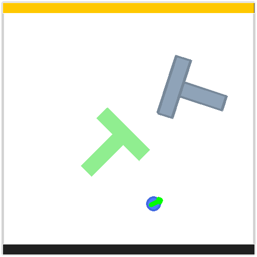

# hil-pusht-env

[](https://github.com/shpigi/hil-pusht-env/actions/workflows/tests.yml)

Standalone PushT environment package with:

- Relative delta action control (`[-1, 1]^2`)
- Dict observations with `state`, `applied_action`, `action_source`, `image`
- Built-in Xbox teleoperation support
- Built-in render overlays (action arrow, time bar, coverage bar, teleop indicator)

## Environment Preview



## Install

```bash
pip install -e .
```

Install with test dependencies:

```bash
pip install -e .[dev]
```

## Agent Setup Rules

Agent-specific environment rules live in `agents/AGENTS.md`.

Preferred local workflow:

```bash
bash scripts/setup_venv.sh
source .venv-hil-pusht/bin/activate
python -m pytest -q
```

If local venv install is blocked by network/index access, use the `shared-control` mamba env:

```bash
bash scripts/test_shared_control.sh
```

Equivalent make targets:

```bash
make setup-venv
make test-venv
make test-mamba
```

## Quickstart

```python
import numpy as np
from hil_pusht_env import PushTEnv, PushTEnvConfig

env = PushTEnv(PushTEnvConfig(render_size=96, enable_teleop=False))
obs, info = env.reset(seed=0)

action = np.array([0.25, -0.1], dtype=np.float32)
obs, reward, terminated, truncated, info = env.step(action)
frame = env.render(mode="rgb_array")

env.close()
```

## Observation Contract

- `state`: `float32`, shape `(5,)`, `[agent_x, agent_y, block_x, block_y, block_angle]`
- `applied_action`: `float32`, shape `(2,)`, actual delta applied by env
- `action_source`: `"policy" | "teleop"`
- `image`: `float32`, shape `(3, H, W)`, range `[0, 1]`

## Action Contract

- `step(action)` expects relative delta action in `[-1, 1]^2`
- Delta is scaled by `delta_scale_pixels` and converted to an absolute target internally

## Teleop

Set `enable_teleop=True` in `PushTEnvConfig` to enable Xbox teleoperation.

Default mapping:

- `LB`: hold to enable teleop
- Right stick: move
- `RT`: variable speed boost

Run the packaged CLI:

```bash
hil-pusht-teleop --help
```
